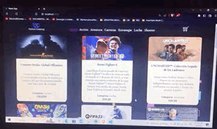

# Online Gaming App
## _OG-App. Tienda de videojuegos online_

Esta aplicacion es un proyecto que forma parte de la entrega final para la certificacion en React js de la academia online CoderHouse.  Creada en base al diseño de una SPA serverless para brindrarle una experiencia rápida y fluida al usuario.

El usuario puede seleccionar productos de la pagina principal, filrar por categorias, visualizar su carrito y realizar un proceso de compra sin problemas.

## Previsualización de la navegacion en la página

## Tecnologías utilizadas

- React Js⚛
- firebase🔥
- Iconos de Bootstrap Icons 🅱
- CSS puro ✨
- HTML

OG-App forma parte de mi repertorio de proyectos personales. Si te gustaria ver más de mis trabajos, visita mi repositorio 👉 https://github.com/voluspak

Proximamente se adaptará el sitio web a un diseño responsive para visualizarse en dispositivos móviles